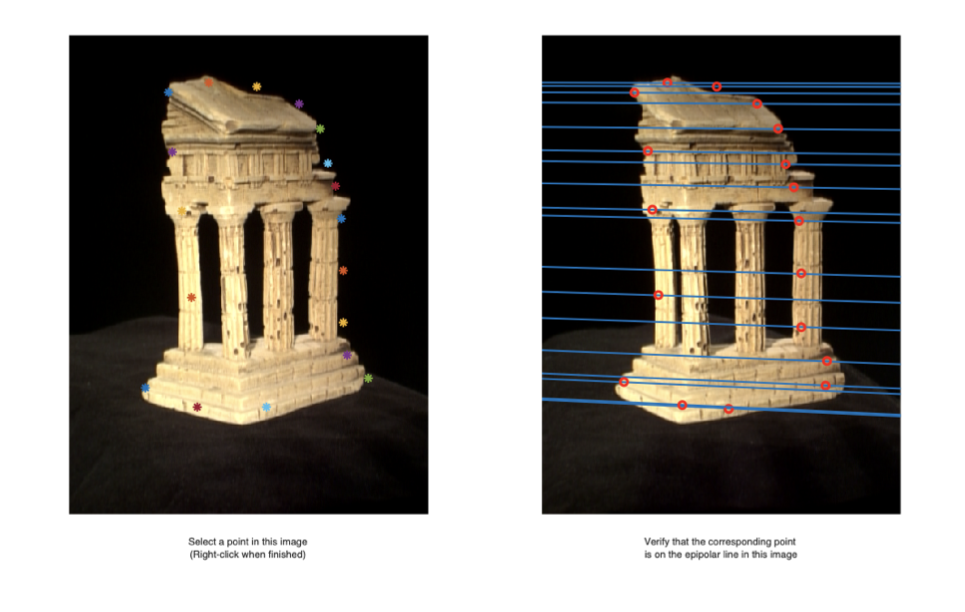
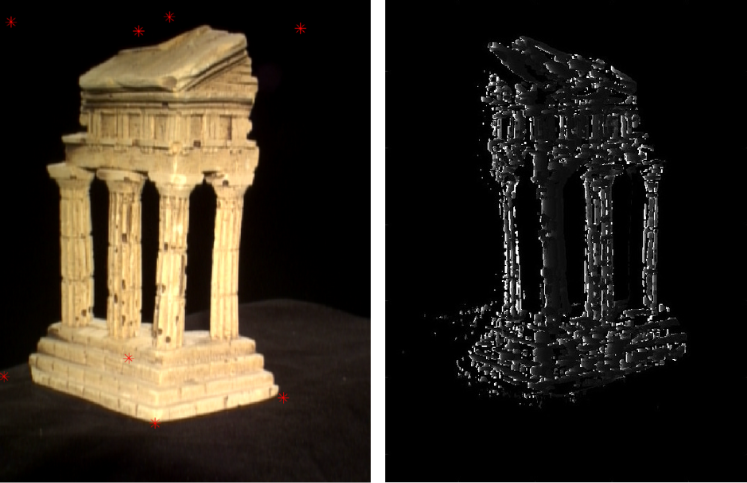

# 3D Reconstruction

A key domain within computer vision involves 3D reconstruction, which focuses on the challenge of reconstructing the three-dimensional structure of an environment and determining the camera or robot's position from a set of 2D images. This capability is vital in robotics and autonomous systems, where comprehending the 3D layout of the surroundings plays a crucial role in effective navigation. It helps prevent undesirable scenarios such as robots colliding with walls or unintentionally posing a risk to humans.

## Introduction

This project is attempt to solve 2 problems in 3D reconstruction: sparse reconstruction and dense reconstruction.

### Sparse Reconstruction

Sparse reconstruction involves creating a 3D representation of a scene using only a limited number of key points or features extracted from 2D images. The goal is to identify distinctive points in each image and then match these points across multiple images to triangulate their 3D positions. This approach is particularly useful when computational resources are limited or when dealing with large datasets.

#### Results sample

#### Dense reconstruction

Dense reconstruction, aims to create a more detailed 3D model of the scene by estimating the depth at every pixel in the images. This means that for each pixel in an image, the algorithm calculates its corresponding 3D position in the scene. Dense reconstruction provides a richer representation of the environment but is computationally more demanding compared to sparse reconstruction.

#### Results sample

### References

There are helper code from University of Western Australia by Peter Kovesi from `estimate_params.m` in <a href="https://github.com/claredang/3d-reconstruction/">here</a>.
